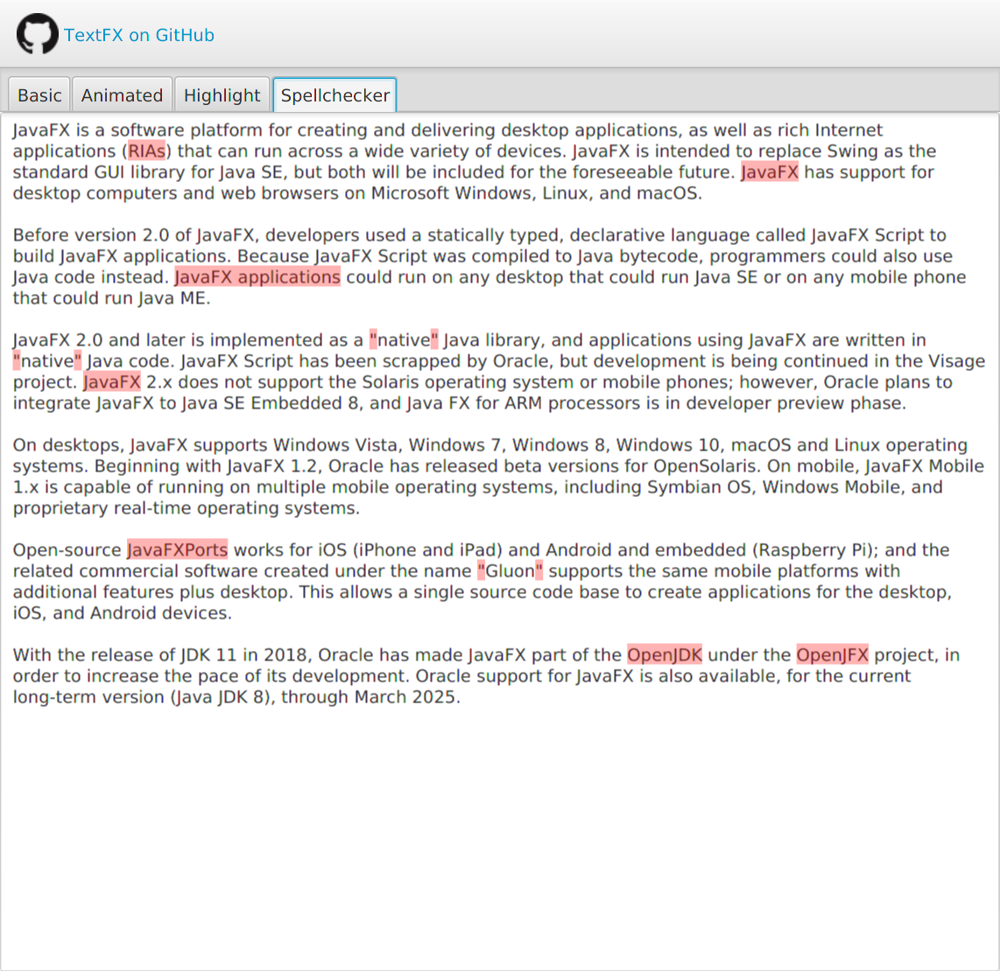
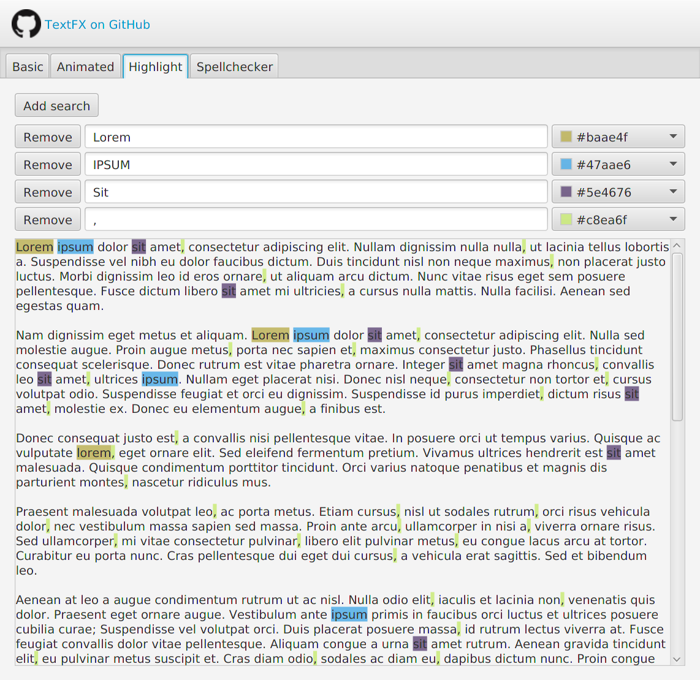
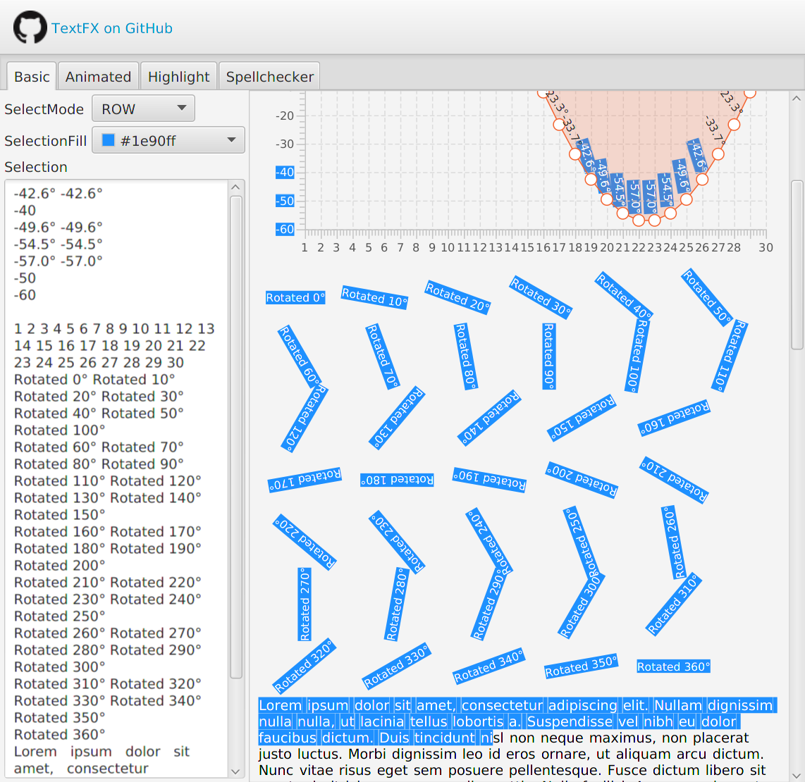

TextFX
==========

[](https://travis-ci.org/tom91136/TextFX)
[](https://opensource.org/licenses/Apache-2.0)
[](https://bintray.com/tom91136/maven/textfx/_latestVersion)

A small collection of text related controls and utilities that is frequently needed but missing from the JavaFX API.
 
Controls

 * `HighlightPane` - enables highlighting with multiple markers on arbitrary nodes with any parent at any depth 
 * `TextSelectPane` - enables a column or row based text node selection on any parent at any depth with scrolling at edge 
 * `NoCacheScrollView` - a patched `ScrollView` that fixes issues with blurry text rendering on certain platforms

Utilities

 * `Nodes.findParent` - Stack safe scene graph traversal from leaf to parent
 * `Nodes.collectNodes*` - Stack safe scene graph traversal from node to leaves, faster than `Node.lookupAll`

Known limitations
 * `TextSelectPane` does not work with `TextFlow` as it doesn't actually render the text using the `Text` node itself. As a workaround, use `FlowPane` with manually tokenised text nodes. 
 * `TextSelectPane` does not currently handle `Text` nodes that span multiple lines. This is an intrinsic limitation of `Text` node API as only a single start and end pair is supported.
 * Only OpenJFX 11+ is supported as the `Text` selection and shape APIs was private before this version. 


|  |   |   |
|---|---|---|
| Spellchecker implemented using `HighlightPane` on a `TextArea` using [LanguageTool](https://github.com/languagetool-org/languagetool) |  A text search view implemented using `HighlightPane` |  Arbitrary text node selection with transforms in a `TextSelectPane`   |


If you are looking to do more advanced things I recommend taking a look a [RichTextFX](https://github.com/FXMisc/RichTextFX), it does have a bit of a learning curve though.

## How to use

For Maven users, add the following to pom
```xml
<dependency>
    <groupId>net.kurobako</groupId>
    <artifactId>textfx</artifactId>
    <version>0.1.0</version>
</dependency>
```
You also need to add jcenter repo to your pom:
```xml
<repositories>
    <repository>
        <id>jcenter</id>
        <url>https://jcenter.bintray.com/</url>
    </repository>
</repositories>
```

For SBT
```scala
"net.kurobako" % "textfx" % "0.1.0"    
```
And also jcenter:
```scala
resolvers ++= Seq(Resolver.jcenterRepo)
```

Alternatively, you can download the jar [here](https://dl.bintray.com/tom91136/maven/net/kurobako/textfx/textfx/0.1.0/textfx-0.1.0.jar)
 and add it to your classpath.
 
Version history in available in [CHANGELOG.md](CHANGELOG.md)

## Quick start

//TODO

For more interesting examples, take a look at the [samples](textfx-sample/src/main/java/net/kurobako/textfx/sample).

## Samples

Several samples have been included demoing interesting uses of all the controls.

You can download the sample jar [here](https://dl.bintray.com/tom91136/maven/net/kurobako/textfx/textfx-sample/0.1.0/textfx-sample-0.1.0-jar-with-dependencies.jar) 
or clone the project and run:

    ./mvnw install
    ./mvnw exec:java -pl textfx-sample

## How to build

Prerequisites:

 * JDK 11

Clone the project and then in project root:

    # *nix:
    ./mvnw clean package 
    # Windows:
    mvnw clean package

This project uses maven wrapper so you do not need to install maven
beforehand.

For testing on new platforms, it is recommended to run tests headful. Add the headful flag to test
with real window:

    mvnw test -Dheadful

**NOTE: Be aware that running the tests headful will spawn actual windows and take over the mouse 
and keyboard; you will see the test window flicker while different unit tests are invoked.**

## Motivation

This [issue](https://bugs.openjdk.java.net/browse/JDK-8092278) looks like it's never getting resolved, so I guess someone has to jump in.

## Licence

    Copyright 2017 WEI CHEN LIN
    
    Licensed under the Apache License, Version 2.0 (the "License");
    you may not use this file except in compliance with the License.
    You may obtain a copy of the License at
    
       http://www.apache.org/licenses/LICENSE-2.0
    
    Unless required by applicable law or agreed to in writing, software
    distributed under the License is distributed on an "AS IS" BASIS,
    WITHOUT WARRANTIES OR CONDITIONS OF ANY KIND, either express or implied.
    See the License for the specific language governing permissions and
    limitations under the License.